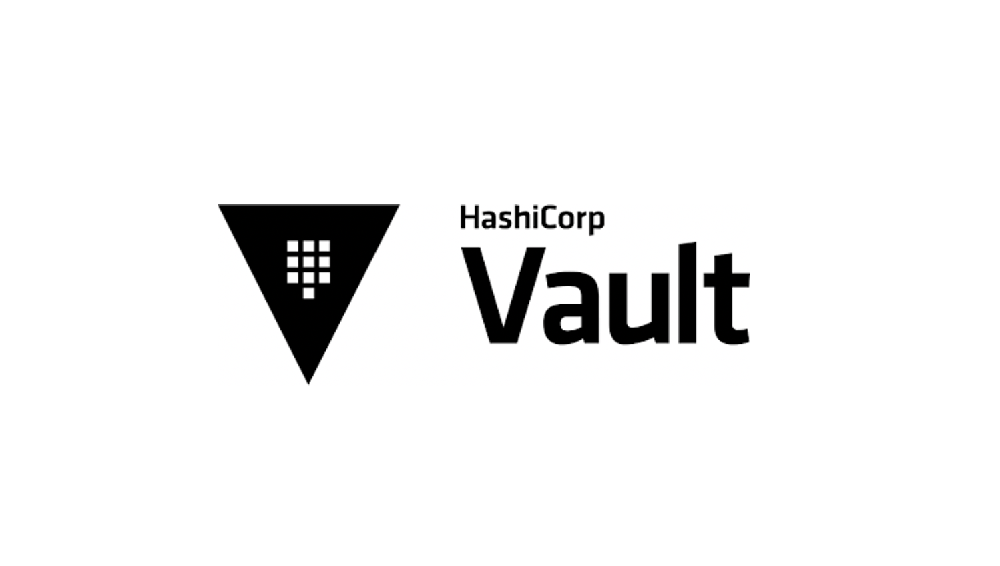

# Hashicorp Vault Interview Questions and Answers
##### Vault secures, stores, and tightly controls access to tokens, passwords, certificates, API keys, and other secrets in modern computing.

### Collected sources of questions
* ##### devopsschool
* ##### climbtheladder


## What is Hashicorp Vault?
Hashicorp Vault is a tool for managing secrets. It can be used to store and manage sensitive data, such as passwords, API keys, and certificates. Vault can be used to encrypt and decrypt data, as well as to generate and manage secrets.

## What is vault associate?
The Vault Associate certification is for Cloud Engineers specializing in security, development, or operations who know the basic concepts, skills, and use cases associated with open source HashiCorp Vault.

## Can we store files in HashiCorp vault?
If you want to store large files inside of Vault:
It’s a simpler setup and you can do point-in-time live snapshots. Plus if you find you need the space in the future, you can just migrate your storage backend.

## Is HashiCorp vault on premise?
HashiCorp Vault: Multi-Cloud Secrets Management Simplified
Vault allows you to centrally manage and securely store secrets across on-premises infrastructure and the cloud using a single system. The Vault API exposes cryptographic operations for developers to secure sensitive data without exposing encryption keys.

## What are secrets HashiCorp?
Secrets engines are Vault components which store, generate or encrypt secrets. In Your First Secrets tutorial, you used the key/value v2 secrets engine to store data. Some secret engines like the key/value secrets engines simply store and read data. … Other secret engines provide encryption as a service.

## How does HashiCorp vault store keys?
SSH keys to connect to remote machines are shared and stored as plaintext. API keys to invoke external system APIs are stored as plaintext. An app integrates with LDAP, and its configuration information is in plaintext.

## What is the HashiCorp key vault?
HashiCorp Vault enables organizations to secure, store, and tightly control access to tokens, passwords, certificates, encryption keys for protecting secrets and other sensitive data using a UI, CLI, or HTTP API.

## What is the backend in the vault?
The storage stanza configures the storage backend, which represents the location for the durable storage of Vault’s information. Each backend has pros, cons, advantages, and trade-offs. For example, some back ends support high availability while others provide a more robust backup and restoration process.

## What is Vault cloud?
Vault Cloud provides premium, full-service cloud computing solutions with Australia’s highest security standards. Built on advanced OpenStack architecture with powerful Intel processors, lightning-fast solid-state storage, and AI and machine learning accelerators, it also delivers unparalleled performance.

## Can you explain the architecture of a basic Hashicorp Vault deployment?
A Hashicorp Vault deployment typically consists of a single server, known as the “vault server”. This server is responsible for storing and managing the secrets that are stored in Hashicorp Vault. Clients that wish to access these secrets connect to the vault server and authenticate using their credentials. Once authenticated, the client is able to access the secrets that they have permission to view.

## How does Hashicorp Vault work?
Hashicorp Vault is a tool for managing secrets. It allows you to store, manage, and rotate secrets securely. Vault uses a number of techniques to achieve this, including encryption, dynamic secrets, and role-based access control.

## What are some advantages and disadvantages of using Hashicorp Vault?
Some advantages of using Hashicorp Vault include its high security and its ability to store sensitive data. However, some disadvantages include its high cost and the fact that it can be difficult to use.

## What type of data can be stored in Hashicorp Vault?
Hashicorp Vault can store any type of data, but it is often used to store sensitive data such as passwords, API keys, and other secrets.

## Is it possible to use Hashicorp Vault on Azure Cloud, AWS or GCP? If yes, then how?
Yes, it is possible to use Hashicorp Vault on Azure Cloud, AWS or GCP. You can either install Hashicorp Vault on a server within your cloud environment, or you can use a Hashicorp Vault provider.

## What types of authentication methods are supported by Hashicorp Vault?
Hashicorp Vault supports a variety of authentication methods, including tokens, GitHub authentication, LDAP, and AppRole.

## What are some examples of secrets that can be stored in Hashicorp Vault?
Secrets that can be stored in Hashicorp Vault include API keys, database passwords, and SSH keys.

## What are Dynamic Secrets?
Dynamic secrets are secrets that are generated on-demand, and then revoked when they are no longer needed. This is in contrast to static secrets, which are generated once and then remain valid until they are explicitly revoked. Dynamic secrets are often used for sensitive data like API keys, database passwords, and so on.

## What are Static Secrets?
Static secrets are secrets that are stored in a file or database and are not rotated or changed. An example of a static secret would be a password that is used to access a database.

## What are Credential Engines?
Credential Engines are a type of secrets engine that is used to generate dynamic credentials. These credentials can be used to access various systems and services, and they can be rotated on a regular basis to help improve security.

## What are Transparent Data Encryption (TDE) keys? How do they differ from other keys?
TDE keys are used to encrypt data at rest, meaning that they are used to encrypt data that is not currently being used or accessed. This is in contrast to other keys, which are used to encrypt data that is currently being used or accessed. TDE keys are typically used in conjunction with a database, in order to protect the data stored in the database from being accessed by unauthorized individuals.

## What is an audit device?
An audit device is a piece of hardware or software that is used to monitor and record activity on a computer system. This information can then be used to help improve security, troubleshoot issues, and track down unauthorized activity.

## What kinds of cryptographic algorithms are used with Hashicorp Vault?
Hashicorp Vault uses a number of different cryptographic algorithms in order to provide security for the data that it stores. These include algorithms like SHA-256, AES-256, and ECDSA.

## What’s the difference between root tokens and child tokens?
Root tokens are the most powerful tokens in Hashicorp Vault and have full access to all of the secrets stored in the Vault. Child tokens are created by the root token and can be given more limited access to the secrets stored in the Vault.

## How many policies can be created in Hashicorp Vault?
There is no limit to the number of policies that can be created in Hashicorp Vault.

## What happens if someone tries to read a secret value without having sufficient permissions?
If someone tries to read a secret value without having sufficient permissions, they will be denied access.

## What happens when a user attempts to log into Hashicorp Vault using incorrect credentials?
When a user attempts to log into Hashicorp Vault using incorrect credentials, they will be denied access and will receive an error message.

## Can you give me more information about ACLs?
ACLs, or access control lists, are a way of specifying which users or groups can access which resources. In Hashicorp Vault, ACLs can be used to control access to secrets, keys, and other sensitive data. Each ACL has a set of rules that determine who can access what.

## What are the main components of Sentinel?
The main components of Sentinel are the policy engine, the enforcement engine, and the data store. The policy engine is responsible for evaluating policies against data stored in the data store. The enforcement engine is responsible for taking action on behalf of the policy engine, such as revoking a user’s access to a resource. The data store is where Sentinel stores its data, such as policies, user information, and resource information.

## What are Auth Methods?
Auth methods are the components in Vault that perform authentication and are responsible for assigning identity and a set of policies to a user.

##  Why there are so many Auth Methods?
Having multiple auth methods enables you to use an auth method that makes the most sense for your use case of Vault and your organization.

For example, on developer machines, the GitHub auth method is easiest to use. But for servers the AppRole method is the recommended choice.

## You can customize the mount path when you are enabling Auth Methods. Is this true, if so, why?

True - Allowing users with advanced use cases to mount a single auth method multiple times.

## When an auth method is disabled, what happens to all the users authenticated via that method?

When an auth method is disabled, all users authenticated via that method are automatically logged out.

## What is the command to create a token?

vault token create

## How do you log in with the token you created?

vault login <generated token>

## When you revoke the token what happens to all the tokens it created?

When a token is revoked it will revoke all the tokens that it created.

## How do you enable the GitHub Auth Method?

vault auth enable github

The auth method is enabled and available at the path auth/github/

## How do you configure GitHub engineering team authentication to be granted the default and application policies?

vault write auth/github/map/teams/emgineering value=default,applications

## What is the command to list all the authentication methods that Vault has enabled?

vault auth list

## Explain the authentication process of the Vault?

Before a client can interact with Vault, it must authenticate against an auth method. Upon authentication, a token is generated. This token is conceptually similar to a session ID on a website. The token may have attached policy, which is mapped at authentication time.

## What does this statement vault write sys/auth/my-auth type=userpass mean?

This enables the “userpass” auth method at the path “my-auth”. This authentication will be accessible at the path “my-auth”. Often you will see authentications at the same path as their name, but this is not a requirement.

## What is the AppRole Auth method is used for?

AppRole is an authentication mechanism within Vault to allow machines or apps to acquire a token to interact with Vault. It uses RoleID and SecretID for login.

## Give an example of the auth method, which is used for users?

LDAP

## You have a scenario where a DevOps team wants to configure Jenkins to read secrets from Vault so that it can inject the secrets into an app’s environment variables (e.g. MYSQL_DB_HOST) at deployment time. How can a Jenkins server programmatically request a token so that it can read secrets from Vault?

Enable AppRole auth method so that the Jenkins server can obtain a Vault token with appropriate policies attached. Since each AppRole has attached policies, you can write fine-grained policies limiting which app can access which path.

## When enable authrole what are the two ids that apps use to log in?

```
RoleID
SecretID
```
example

```
vault write auth/approle/login \
role_id=”675a50e7-cfe0-be76-e35f-49ec009731ea” \
secret_id=”ed0a642f-2acf-c2da-232f-1b21300d5f29″
```

## What is the Pull Mode in Auth Method Authentication?

If the SecretID used for login is fetched from an AppRole, this is operating in Pull mode.

## What is the Push Mode in Auth Method Authentication?

If a “custom” SecretID is set against an AppRole by the client, it is referred to as a Push mode.

## Which auth method you should use to authenticate with the vault using OIDC or by providing a JWT?

JWT/OIDC

## Which auth method allows users to authenticate using a token?

token

Create Vault policies

Practice questions based on these concepts

Illustrate the value of Vault policy

Describe Vault policy syntax: path

Describe Vault policy syntax: capabilities

Craft a Vault policy based on requirements

## What are Policies?

Policies provide a declarative way to grant or forbid access to certain paths and operations in Vault.

## Policies are denied by default. Is this true?

True - Policies are deny by default, so an empty policy grants no permission in the system.

## Can you explain the Policy Syntax?

Policies are written in HCL or JSON and describe which paths in Vault a user or machine is allowed to access.

Policies use path-based matching to test the set of capabilities against a request. A policy path may specify an exact path to match, or it could specify a glob pattern which instructs Vault to use a prefix match:

```
path “secret/foo” {
     capabilities = [“read”]
}
```

Permit reading only “secret/foo”. An attached token cannot read “secret/food” or “secret/foo/bar”.

```
path “secret/foo” {
capabilities = [“read”]
}
```
Permit reading everything under “secret/bar”. An attached token could read  “secret/bar/zip”, “secret/bar/zip/zap”, but not “secret/bars/zip”.

```
path “secret/bar/*” {
capabilities = [“read”]
}
```

Permit reading everything prefixed with “zip-“. An attached token could read  “secret/zip-zap” or “secret/zip-zap/zong”, but not “secret/zip/zap

```
path “secret/zip-*” {
capabilities = [“read”]
}
```

## You want to Permit reading the “teamb” path under any top-level path under secret/. How do you define the policy?

```
path “secret/+/teamb” {
    capabilities = [“read”]
}
```

## Why Policies with list capabilities should end with a trailing slash?

When providing list capability, it is important to note that since listing always operates on a prefix, policies must operate on a prefix because Vault will sanitize request paths to be prefixes. In other words, policy paths targeting list capability should end with a trailing slash:

## What are all the available capabilities for the policies?

* Create (POST/PUT) – Allows creating data at the given path. Very few parts of Vault distinguish between create and update, so most operations require both create and update capabilities. Parts of Vault that provide such a distinction are noted in documentation.

* Read (GET) – Allows reading the data at the given path.

* Update (PUT/POST) – Allows changing the data at the given path. In most parts of Vault, this implicitly includes the ability to create the initial value at the path.

* Delete (DELETE)- Allows deleting the data at the given path.

* List (LIST)- Allows listing values at the given path. Note that the keys returned by a list operation are not filtered by policies. Do not encode sensitive information in key names. Not all backends support listing.

* sudo – Allows access to paths that are root-protected. Tokens are not permitted to interact with these paths unless they have the sudo capability (in addition to the other necessary capabilities for performing an operation against that path, such as read or delete).

* deny – Disallows access. This always takes precedence regardless of any other defined capabilities, including sudo.

## Can we store files in HashiCorp vault?
If you want to store large files inside of Vault:
It’s a simpler setup and you can do point-in-time live snapshots. Plus if you find you need the space in the future, you can just migrate your storage backend.

## What can be stored in the HashiCorp vault?
Vault encrypts data using 256-bit AES with GCM. It can store data in various backends (files, Amazon DynamoDB, Consul, etc, and much more). The other key aspect is that Vault never stores a key in a persistent location.

## nIs HashiCorp vault on premise?
HashiCorp Vault: Multi-Cloud Secrets Management Simplified
Vault allows you to centrally manage and securely store secrets across on-premises infrastructure and the cloud using a single system. The Vault API exposes cryptographic operations for developers to secure sensitive data without exposing encryption keys.

## What are secrets HashiCorp?
Secrets engines are Vault components which store, generate or encrypt secrets. In Your First Secrets tutorial, you used the key/value v2 secrets engine to store data. Some secret engines like the key/value secrets engines simply store and read data. … Other secret engines provide encryption as a service.

## How does HashiCorp vault store keys?
SSH keys to connect to remote machines are shared and stored as plaintext. API keys to invoke external system APIs are stored as plaintext. An app integrates with LDAP, and its configuration information is in plaintext.

## What is the HashiCorp key vault?
HashiCorp Vault enables organizations to secure, store, and tightly control access to tokens, passwords, certificates, encryption keys for protecting secrets and other sensitive data using a UI, CLI, or HTTP API.

## What is the backend in the vault?
The storage stanza configures the storage backend, which represents the location for the durable storage of Vault’s information. Each backend has pros, cons, advantages, and trade-offs. For example, some back ends support high availability while others provide a more robust backup and restoration process.

## What is Vault cloud?
Vault Cloud provides premium, full-service cloud computing solutions with Australia’s highest security standards. Built on advanced OpenStack architecture with powerful Intel processors, lightning-fast solid-state storage, and AI and machine learning accelerators, it also delivers unparalleled performance.

## Is it possible to start Vault dev server on 0.0.0.0 instead of 127.0.0.1?
Start your Vault server with the following command:
vault server -dev -dev-listen-address=”0.0.0.0:8200″
You can also specify the address via the VAULT_DEV_LISTEN_ADDRESS environment variable.

## You have a requirement to enable and manage authentication methods broadly across vault. How do you define the policy?
Manage auth methods broadly across Vault
```
path "auth/*"
{
capabilities = ["create", "read", "update", "delete", "list", "sudo"]
}
```

## You have a requirement to create, update, and delete auth methods. How do you define the policy?
Create, update, and delete auth methods
```
path "sys/auth/*"
{
capabilities = ["create", "update", "delete", "sudo"]
}
```

## You have a requirement to manage the secrets engine. How do you define the policy?
Manage secrets engines
```
path "sys/mounts/*"
{
capabilities = ["create", "read", "update", "delete", "list", "sudo"]
}
```

## What are the built-in policies in the vault?
root policy
default policy

## You can’t modify the default policy. True/False?
False

## You can’t modify or remove the root policy. True/False?
True

## How do you create a token without a default policy attached to it?
vault token create -no-default-policy

## You want to create a policy at the path secret/foo with the parameters named bar and baz. These parameters are required. How do you define the policy?
required_parameters – A list of parameters that must be specified.

```
path “secret/foo” {
    capabilities = [“create”]  
    required_parameters = [“bar”, “baz”]

}
```

## How do you whitelists a list of keys and values that are permitted on the given path when defining the policy?
allowed_parameters

## How do you blacklist a list of keys and values that are permitted on the given path when defining the policy?
denied_paramters

## You want to access root-protected paths with the token. Which capability should you give?
sudo

## of all the capabilities which take precedence when specified?
Deny


